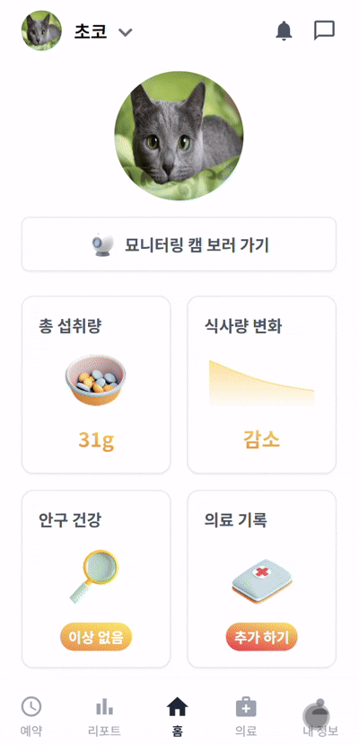
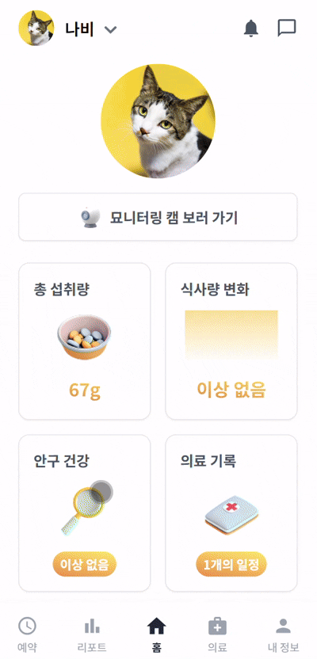
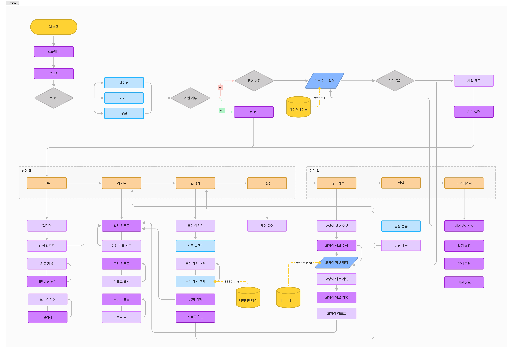
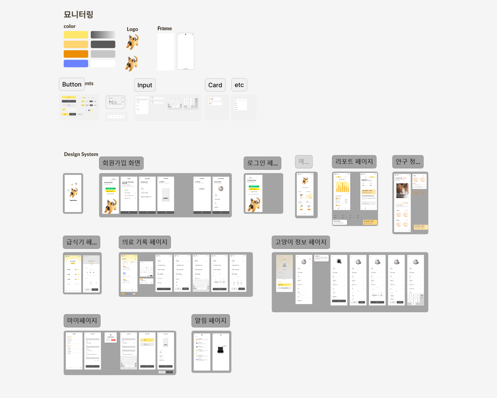

# Myonitoring

 

## 🐾 프로젝트 개요

- **프로젝트 이름**: Myonitoring(묘니터링)
- **진행 기간**: 2025.01.13 ~ 2025.02.19 (6주)
- **서비스 한줄 소개**:

```bash
AIoT 기술을 활용한 고양이 안구 상태와 섭취량 실시간 추적 및 분석을 통해 건강 관리를 돕는 스마트 자동 급식기 애플리케이션
```

<br>

## 🐱 프로젝트 배경

### 1. 시장 및 문제 인식

- **반려동물 시장의 성장**
  - 스마트 애완동물 급식기 시장은 연평균 25.1% 성장 중으로, 반려동물 관리 솔루션에 대한 수요가 증가하고 있음.
- **고양이 안구 질환의 중요성**
  - 고양이의 안구 질환은 초기 증상이 미미하지만 조기 발견과 치료가 필수적임.
- **기존 서비스의 한계**
  - 대부분의 자동 급식기는 단순 급여 기능에 국한되며, 건강 상태 모니터링 및 질병 감지 기능이 부족함.

### 2. 페인포인트 및 사용자 니즈

- **질병 조기 발견의 어려움**
  - 고양이는 아픔을 숨기는 습성이 있어 이상 징후를 놓치기 쉬움.
- **반려인의 부재로 인한 관리 한계**
  - 맞벌이 가정이나 1인 가구는 고양이 상태를 지속적으로 확인하기 어려움.
- **기존 자동 급식기의 기능적 한계**
  - 정해진 시간과 양 조절만 가능하며, 건강 상태나 식습관 변화에 대한 대응 기능이 없음.

### 3. 프로젝트 목표

- **AIoT 기술 기반 건강 관리 솔루션 제공**
  - 고양이 안구 상태와 섭취량을 실시간으로 추적 및 분석하여 건강 이상 징후를 조기에 감지.
- **사용자 편의성 증대**
  - 원격 모니터링, 건강 리포트, 알림 시스템으로 보호자의 관리 부담을 줄임.

<br>

## 🚩 서비스 차별점

### 기술적 독창성

- **AI 기반 얼굴 인식 기술**  
  카메라와 AI를 결합하여 고양이를 식별하고 안구 상태를 분석.
- **지속적 데이터 분석**  
  매일 수집된 데이터를 바탕으로 자동화된 건강 관리 제공.

### 사용자 편의성

- 배급기 원격 제어 및 실시간 모니터링 가능.
- 간편한 UI/UX로 누구나 쉽게 사용할 수 있는 모바일 애플리케이션.

<br>

## 💡 주요 기능 및 서비스 화면

### **1. 스플래쉬 화면 및 메인 화면**

<div style="display: flex; justify-content: center; gap: 10px;">
  
  
</div>
<br>

### **1. 카카오 소셜 로그인 및 회원 관리**

- 사용자는 카카오 계정을 통해 간편하게 회원가입 및 로그인 가능.
- 사용자 프로필 및 고양이 정보(이름, 나이, 체중 등) 등록 및 관리.

### **2. 고양이 별 배급 관리**

- 기기와 고양이 별로 사료 배급 예약 및 배급 실행 가능.
- 사료량 부족 또는 기기 이상 발생 시 사용자에게 알림 전송.

<div style="text-align: center;">
  
</div>
<br>

### **3. 연동 기기 관리**

- 기기 정보 확인 가능.
- 기기 별로 고양이 등록 가능.
  <div style="text-align: center;">
  
</div>
<br>

### **4. 안구 상태 모니터링 및 분석**

- 자동 급식기에 탑재된 카메라로 고양이의 안구 데이터를 수집.
- AI 기반 분석을 통해 안구 질환(충혈, 각막 손상 등) 이상 확률 표시.
- 이상 징후 발견 시 상세 리포트 생성 및 푸쉬 알림 전송.
  <div style="text-align: center;">
  
</div>
<br>

### **5. 섭취량 추적 및 이상 감지**

- 고양이가 섭취한 사료량을 실시간으로 기록하고, 사용자에게 막대그래프로 시각화하여 제공.
- 일별, 주별 섭취량 기록을 상세히 확인 가능.
- 섭취량이 지속적으로 증가하거나 감소하는 경우 섭취량 이상 리포트 생성 및 알림 전송.
  <div style="display: flex; justify-content: center; gap: 10px;">
  
  
</div>
<br>

### **6. 홈캠 기능**

- 자동 급식기에 내장된 카메라를 통해 실시간으로 고양이의 상태를 확인 가능.
- 어플 내 "묘니터링 캠 보러가기기" 버튼으로 간편하게 실시간 화면 제공.

### **7. 의료 기록 관리**

- 사용자는 정기검진, 치료, 기타 카테고리별로 의료 일정(제목, 설명, 병원, 날짜)을 등록, 수정, 삭제 가능.
- 기간 설정을 통해 특정 기간 내의 의료 일정 조회 가능.
  <div style="text-align: center;">
  
</div>

<br>

## 📁 프로젝트 구조

### Back-end

### Front-end

<br>

## 📃 설계 및 산출물

### 유저 플로우
  

### 와이어프레임
  


### 시스템 아키텍처


### ERD


### 요구사항 명세서

### 기능 명세서

### API 명세서

<br>

## 🛠️ 기술 스택

| 대분류    | 소분류                                                   |
| --------- | -------------------------------------------------------- |
| Front-end | React 18.2.0, React PWA 적용, Redux, Tailwind CSS 3.4.17 |
| Back-end  | Java 17, Spring Boot 3.0+, Python 3.9, FastAPI           |
| Database  | MySQL                                                    |
| Infra     | Docker, Jenkins, nginx, AWS(EC2), Firebase               |
| AI        | YOLO (TensorFlow/PyTorch), MobileNet                     |

<br>

## 👥 팀원 소개

| 이름   | 역할          | 주요 담당 |
| ------ | ------------- | --------- |
| 제서윤 | 팀장 / 백엔드 |           |
| 김성태 | 인프라        |           |
| 김진실 | 백엔드        |           |
| 이재욱 | 임베디드, AI  |           |
| 정효원 | 프론트엔드    |           |
| 최현정 | 프론트엔드    |           |
